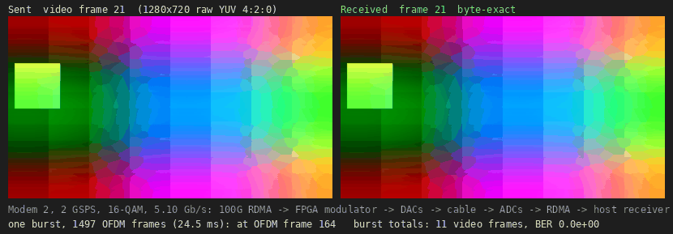

-9A90FD.svg) -orange.svg) -purple.svg)   

[English](#en) | [中文](#cn)

　

<span id="en">OFDM modem in the FPGA at 2 and 4 GSPS, over 100G RDMA</span>
===========================

**Modem 2**: an OFDM modem for two independent ends (independent lasers or oscillators, independent sample clocks), an optical link through CFP2-ACO modules or RF up and down conversion, designed for the worst case and built in the FPGA, bit-exact with its C models. The host only sends and checks payloads over RoCE v2 (AMD ERNIC, 100G), on the streaming core of [rfsoc4x2_rdma_ofdm](https://github.com/uceeyuf/rfsoc4x2_rdma_ofdm). Board: RFSoC 4x2 (XCZU48DR), loopback DAC_A → ADC_B (I), DAC_B → ADC_D (Q), multi-tile synchronised; ZCU208 (the same XCZU48DR) with four DACs and four ADCs.

* **Transmitter, on the board**: `m2_tx` at 2 GSPS (8 × 1024-point IFFT) and 4 GSPS (16 lanes). 2 GSPS: EVM −37.2 dB at 16 / 64 / 256-QAM, 16-QAM (5.10 Gb/s) without an error in 415 M bits. 4 GSPS: 256-QAM (20.4 Gb/s) EVM −34.4 dB.
* **Receiver, on the board**: `m2_rx`, two polarizations, entirely in the FPGA and in real time (a frame every 4096 cycles at 250 MHz, 61035 frames/s), the whole chain bit-exact with the model. FPGA transmitter → cable → FPGA receiver at 2 GSPS, 16-QAM (5.10 Gb/s): 1.40 M frames, BER 5.0 × 10⁻¹⁰. At 4 GSPS in bursts (both branches into an on-chip buffer, the same receiver at half speed): no error in 66.9 M bits.
* **ZCU208**: a four-channel version at 2 GSPS (four DACs, four ADCs, UltraRAM play / capture over the A53, CLK104, no ERNIC) is built, and one with Modem 2's transmitter and receiver (four in, four out).

**This repository documents the design and the measurements; the source of the FPGA modem (RTL, bit-exact models, testbenches) is not published.**

　

## How it works

```
host: payloads -> RDMA WRITE -> rf_stream TX ring (32 KB slots) -> m2_tx (S lanes x IFFT) -> DAC_A / DAC_B
host: checker  <- RDMA WRITE WITH IMMEDIATE <- rf_stream RX ring <- m2_rx (2 branches) <- ADC_B / ADC_D, ADC_A / ADC_C
```

* **rf_stream** is the streaming core of [rfsoc4x2_rdma_ofdm](https://github.com/uceeyuf/rfsoc4x2_rdma_ofdm): TX and RX rings in ERNIC's on-chip window, SQ doorbells from the FPGA, a status word read with RDMA READ. Control bit 3 puts the modulator in the TX path; otherwise the rings carry raw samples (two or four ADCs), which the host receiver works on until `m2_rx` is in.
* **S** is the number of samples per 250 MHz cycle: 8 at 2 GSPS, 16 at 4 GSPS. At 4 GSPS the RF data converter runs its streams at 500 MHz with 8 samples, as in [rfsoc4x2_mts](https://github.com/uceeyuf/rfsoc4x2_mts), and `rf_gear` turns two of those beats into one 250 MHz beat of 16 samples.
* **Frame** (2 GSPS): N = 1024, CP = 128; data on 32 ≤ |k| ≤ 460: 804 data sub-carriers and 54 pilots (every 16th; on −k turned by j^i, so that they carry no pseudo-covariance); a continuous RF pilot tone on bin 8 (15.6 MHz, −6 dB) in the clear band around DC; 32768 samples: an STF (128-sample period, 4 times), two LTFs (the second with k < 0 negated, for the widely linear channel), 26 data symbols. 16-QAM: 5.10 Gb/s before the FEC.

　

## The FPGA transmitter

The transmitter (`m2_tx`) takes S samples per 250 MHz cycle; control bit 3 of rf_stream switches it on, and the TX ring then holds 32 KB payload slots.

* **Schedule.** Symbol *n* starts at cycle *n* × 1152 / S and goes to lane *n* mod S, each with a 1024-point IFFT (xfft v9.1, pipelined, 16-bit input, unscaled). The STF slot plays from a ROM.
* **Lane.** The bin table gives empty, pilot or data, the LTF's signs, the data index (payload order: ascending k) or the pilot's value; the data bits come from the frame's payload buffer, Gray-decoded per axis and mapped to levels already scaled by the gain.
* **Output.** sat16(⌊(y + 32) / 64⌋), cyclic prefix first, plus the RF pilot on every sample.
* **Calibration mode.** The ADCs' background calibration must not see anything synchronous with their 8-way interleaving while it adapts (the RF pilot at fs / 128, the 128-periodic STF, the frame itself): on request the modulator mutes the frames and sends a tone offset from the pilot (bin 8.077) alone; the calibration converges on it and is frozen, then the frames start.
* **Keeping time.** A payload not written in time is modulated as zeros and counted; the frame grid stays.
* **Verification.** The RTL is simulated (xsim, with the IP) and compared with its bit-exact C model sample by sample: identical at 16, 64 and 256-QAM (S = 8) and 16-QAM (S = 16).

　

## The FPGA receiver

`m2_rx`, two branches (polarizations) at 8 samples per cycle, every arithmetic step as in the C model:

| Block | What it does | Simulated against the model | Out of context, 250 MHz |
| :-- | :-- | :-- | :-- |
| front end | DC, blind IQ (from a float32 slow unit), the RF pilot mixed to DC, CIC, NCO, loadable 81-tap FIR, MRC of the branches, CORDIC, the carrier phase interpolated and removed sample by sample | every output sample identical: 16-QAM, CFO 1 MHz, IQ, random polarization (20 k cycles); the worst case (64-QAM, two 300 kHz lasers, CFO 5 MHz, SFO 50 ppm, IQ, skew, random start, 29 k cycles) | WNS +0.043 ns, 558 DSP |
| FFT windows | a sample ring per branch, the blocks' whole-sample starts from the timing loop (window slip, no resampler), 2 × 8 FFT lanes for all 28 symbols | 229 k bins identical (4 frames, 2 branches, CFO, SFO 50 ppm, IQ, random start) | WNS +0.52 ns, 640 DSP |
| channel estimation | LTF estimate, noise per branch, alignment to the running estimate (the timing error's angle, common phase), averaging, delay removal, ±8 smoothing | 27 k values identical (4 frames: every running and smoothed estimate, angles, weights) | WNS +0.50 ns, 252 DSP |
| MMSE | per pair (k, −k) the 2 × 4 widely linear coefficients in float32: 211 operations in the C's order, modulo-scheduled at 8 cycles per pair on 16 multipliers, 9 adders and a divider; the frame's exponent, int18 | 55 k values identical (4 frames: every float and int coefficient) | — |
| data path | 8 engines: the combiner, the 54 pilots' phase and least-squares slope per symbol, rotation, decisions | 63 k decisions identical at 16-QAM, 42 k at 256-QAM in the worst case | — |
| timing loop, packer | the frames' position and rate in Q32 from the alignment angle; the decisions as the payload's bits in 32 KB slots | — | — |

The whole chain (ADC samples in, payload slots out) is bit-exact with the model: 6 frames with CFO 1 MHz, SFO 50 ppm and IQ (every FFT output, every coefficient row, 62.7 k decisions, every pilot result and payload byte), 20 frames at zero offsets (355 k decisions), and two raw board captures (230 k decisions). Real time: the MMSE takes ~3700 of a frame's 4096 cycles (the next frame starts while the last one is quantized), and the FFT's bit-reversed output keeps the timing loop's turn (a frame's LTFs → the next frame's windows) within a frame.

The timing loop works in Q32 fixed point; the coefficients of frame *f* are used from frame *f* + 3 on (the estimation and the MMSE take longer than a frame), which the regression shows to cost nothing measurable but one row (IQ imbalance at zero carrier offset, −1 dB EVM, no errors).

　

## Results

Host: Core Ultra 7 265K, Mellanox ConnectX-4, Ubuntu 24.04. Board: RFSoC 4x2, SMA loopback DAC_A → ADC_B, DAC_B → ADC_D.

| Test | Result |
| :--- | :----- |
| 2 GSPS, FPGA transmitter, receiver on raw ADC captures | the ADCs' calibration converged on the offset tone and frozen; EVM −37.2 dB at 16 / 64 / 256-QAM; 16-QAM (5.10 Gb/s) 0 errors in 415 M bits (BER < 7.2 × 10⁻⁹), 64-QAM 0 / 7.7 M, 256-QAM (10.2 Gb/s) 0 / 10.2 M |
| 4 GSPS, the same | 16-QAM (10.2 Gb/s) −34.2 dB and 64-QAM (15.3 Gb/s) −35.0 dB, both without errors; 256-QAM (20.4 Gb/s) −34.4 dB, BER 4.6 × 10⁻⁵ |
| Video | 16-QAM, 720p, one 24.5 ms burst of 1497 OFDM frames: 11 consecutive video frames byte-exact (Figure 1) |
| 2 GSPS, FPGA transmitter → cable → FPGA receiver, real time | 16-QAM (5.10 Gb/s), 30 s: 1.40 M frames, 59 bit errors in 117 G bits (BER 5.0 × 10⁻¹⁰); 64-QAM BER 2.7 × 10⁻⁷, 256-QAM 1.6 × 10⁻⁶ |
| 2 GSPS receiver without ERNIC (registers over JTAG), the board's DAC player looping two frames | 16-QAM, 30 s: 1.86 M frames, 46 bit errors in 156 G bits (BER 3.0 × 10⁻¹⁰) |
| 4 GSPS receiver in bursts | both branches into an 8-frame on-chip buffer from a given RX time, then the 2 GSPS receiver at half speed (frames 3 … 6 of each burst); 16-QAM, 200 bursts: no error in 66.9 M bits |
| Timing, resources, 2 GSPS transmitter and receiver | all constraints met (WNS +0.011 ns); BRAM 72 %, UltraRAM 85 %, DSP 52 %, LUT 72 % ([report](./docs/results/rdma_ofdm_m2_timing_summary.rpt), [utilisation](./docs/results/rdma_ofdm_m2_utilization.rpt)) |
| Timing, resources, 4 GSPS transmitter | all constraints met (WNS +0.005 ns); BRAM 71 %, UltraRAM 95 %, DSP 15 %, LUT 43 % ([report](./docs/results/rdma_ofdm4g_m2_timing_summary.rpt), [utilisation](./docs/results/rdma_ofdm4g_m2_utilization.rpt)) |
| Timing, resources, 4 GSPS burst receiver | not yet met: WNS −0.301 ns (mostly the CMAC's TX clock; the RF clock −0.052 ns); BRAM 92 %, UltraRAM 94 %, DSP 45 %, LUT 65 % ([report](./docs/results/rdma_ofdm4g_m2b_timing_summary.rpt), [utilisation](./docs/results/rdma_ofdm4g_m2b_utilization.rpt)) |

|  |
| :---------------------------------------------: |
| **Figure1** : Modem 2 on the board, 16-QAM, 720p: one 24.5 ms burst of 1497 OFDM frames, 11 consecutive video frames sent (left) and received byte-exact (right); FPGA transmitter, the ADCs' calibration frozen, receiver offline |

　

## Two independent ends

* **Receiver.**
  * DC removal, then blind IQ correction.
  * The RF pilot, mixed down at its own frequency (so that its image from the transmitter's IQ imbalance stays outside the filter), filtered and combined over the polarizations, removes the carrier offset and the laser phase noise sample by sample.
  * STF detection, then LTF timing (once, host-assisted). The sample clock offset is tracked by a second-order loop on the LTF's phase slope; each block window slips by whole samples (no resampler).
  * Widely linear 2 × (2 · polarizations) combiner per pair (k, −k), whitened by each branch's noise, from the channel smoothed over ±8 sub-carriers after removing its delay; per-symbol pilot phase and slope.
* **Worst case**:
  * two independent lasers of 300 kHz linewidth each;
  * carrier offset 5 MHz, sample clocks 50 ppm apart;
  * IQ imbalance 0.5 dB / 3° at both ends, 200 ps between the polarizations, 5 ps between I and Q;
  * SNR 30 dB, 16-QAM.

  C model with the receiver's data path in fixed point, 12 seeds × 30 frames each:

| RX | bits / errors | BER (95 % Wilson) | per seed | EVM |
| :-- | :-- | :-- | :-- | :-- |
| 1 polarization | 28.1 M / 730 | 2.6 × 10⁻⁵ (2.4 … 2.8 × 10⁻⁵) | 2.3 … 3.1 × 10⁻⁵ | −19.0 … −18.9 dB |
| 2 polarizations, random state | 28.1 M / 876 | 3.1 × 10⁻⁵ (2.9 … 3.3 × 10⁻⁵) | 2.1 … 5.3 × 10⁻⁵ | −19.0 … −18.5 dB |

* **Regression.** 33 conditions, one impairment at a time, then combined (carrier offset ±0.1 … ±7 MHz, a residual one tracked by the in-band pilots only, sample clock ±10 … ±50 ppm, IQ imbalance with and without a carrier offset, a random start and phase, the lasers, AWGN), 12 seeds each, rerun with the RTL's arithmetic after every block: every seed synchronized. It found what single conditions hid: the transmitter's IQ imbalance cost 2.3 dB with a 5 MHz offset (the RF pilot's own image leaking into the pilot filter), fixed by mixing the pilot down at its own frequency.
* **The ADCs' background calibration.** A strong component synchronous with their 8-way interleaving biases it by its phase: the RF pilot (bin 8 = fs / 128) and the frame itself (the STF is 128-periodic); a frame rotated by 30° came out 2.4 dB worse than at 0° or 90°. With the calibration mode above: EVM −29.4 → −37.2 dB at 2 GSPS, −27.5 → −34.2 dB at 4 GSPS.
* **On two boards** (ZCU208 transmitter → RFSoC 4x2 receiver, independent clocks, 13 … 15 ppm apart; 16-QAM, 2 GSPS, SMA cables, real time).
  * The receiver finds the frames itself (STF autocorrelation in the FPGA) and tracks the sample clock from the nominal rate; the host only numbers the payloads for the checker. One board per direction: the receiving board is built without the DAC player (otherwise its UltraRAM, 90 % full, congests the routing and timing is not met; this build meets it, WNS +0.064 ns).
  * The DAC runs at twice the data rate (4 GSPS: the RFDC without its DUC, the FPGA interpolating ×2 with a 55-tap half-band; the 4 GSPS design will use the same filter at 8 GSPS) and a 2.5 GHz low-pass follows it. The DAC's zero-order-hold image at f_DAC − f, aliased back by the other board's ADC, turns at (clock offset × 2 GHz) between independent clocks and had set a floor of −15 dB (BER 1.5 × 10⁻²); at 2 GSPS it sits in band, at 4 GSPS it is 3 GHz away and filtered.
  * The receiving ADCs' background calibration is frozen before the frames start (otherwise it keeps adapting on the frames).
  * 9 runs × 120 s (66 M frames): BER 5.5 × 10⁻⁷ over all, 3.7 … 9.3 × 10⁻⁷ per run, no resynchronisation; EVM −28.0 … −29.3 dB on raw captures (−31.6 … −33.1 dB with a VLFX-1050+ instead, whose stopband covers the image at 2 GSPS).
  * **4 GSPS, four DACs into four ADCs** (the same signal on both pairs, combined by the receiver): the ZCU208's DACs at 8 GSPS, the 4x2's ADCs at 4 GSPS, the receiver in bursts (8 frames buffered, 4 decoded per burst, see below). each I/Q pair in one ADC tile. 200 bursts, 6.7 × 10⁷ bits, no bit error; EVM −31.7 dB on raw captures. 16-QAM at 10.2 Gb/s.
* **FEC** sits behind a generic streaming interface, so codes can be swapped.
  * The staircase code of ITU-T G.709.2 (6.7 %) is commonly operated near 4.5 × 10⁻³ in the literature; that leaves ~85× on the worst seed.
  * RS(544, 514) "KP4" (~2.2 × 10⁻⁴) holds as well: 4.2× on the worst seed.
* **The lasers dominate.** RF oscillators have far less phase noise and offset, so the same receiver has more margin behind an RF mixer.

　

## 4 GSPS

* [x] `m2_tx` and `rf_stream` take S = 16 (16 lanes); the payload fetch is timed per symbol region, since a frame (2048 cycles) is shorter than a lane's symbol.
* [x] The RX ring takes two words per clock crossing (two UltraRAM banks).
* [x] One-shot sample capture: the link cannot carry 4 GSPS of samples (128 Gb/s), so the capture stops at its first overflow, on a chunk boundary (four ADCs: the X and Y of a coherent receiver).
* [x] `rf_gear`: the 500 MHz × 8 streams of the block design to 250 MHz × 16 and back.
* [x] The transmitter board at 4 GSPS (results above). At 4 GSPS one board per direction: the dual-polarization receiver (2 × 16 FFT lanes) goes on a board of its own.
* [x] The receiver at 4 GSPS in bursts (results above): both branches at 16 samples a cycle into UltraRAM and block RAM, read at 8 a cycle by the unchanged 2 GSPS receiver; the frame timing from two raw captures a second apart.
* [x] Its timing closed: the receiving board without the DAC player (WNS +0.003 ns), the receiver's own frame sync on the buffered burst; the two-board results above.
* [x] The transmitter at 4 GSPS with the DACs at 8 GSPS ("No DUC", the FPGA's 55-tap half-band ×2, the DAC streams at 500 MHz).

　

## ZCU208

* [x] Four-channel version at 2 GSPS, no ERNIC: four DACs (228 / 229, one 1024-bit beat for all four, so no skew between them) played from block RAM, four ADCs (224 / 225) captured into UltraRAM (256 k samples each) on the same SYSREF-aligned cycle, multi-tile synchronised; the CLK104 programmed by the A53 over I2C (PL_CLK 500 MHz, SYSREF 5 MHz, the LMX2594s at 2.0 GHz straight into the tiles); timing met (WNS +0.094 ns).
* [x] Four in, four out with Modem 2 (the transmitter from a payload RAM, the receiver with its payload checker, registers over JTAG / the A53): built, timing met (WNS +0.009 ns).
* [x] On the board, as the transmitter of the two-board link above: the DAC at 4 GSPS without the DUC, the FPGA interpolating ×2; the LMK04828 from AMD's table for the CLK104 (PL 500 MHz, SYSREF 10 MHz, the LMX2594s at 4.0 GHz into the DAC tiles).

　

## Citation

If this work helps your research, please cite it:

```bibtex
@misc{yu2026zcu208_4gsps_ofdm,
    author = {Yijie Yu},
    title = {{OFDM modem in the FPGA at 2 and 4 GSPS, over 100G RDMA}},
    year = {2026},
    howpublished = {\url{https://github.com/uceeyuf/zcu208_4gsps_ofdm}},
    note = {GitHub repository},
}
```

GitHub also offers the citation under **Cite this repository** (from [CITATION.cff](CITATION.cff)).

　

## Credits

* Streaming core: [rfsoc4x2_rdma_ofdm](https://github.com/uceeyuf/rfsoc4x2_rdma_ofdm).
* RDMA side: [rfsoc4x2_ernic](https://github.com/uceeyuf/rfsoc4x2_ernic).
* RF side: [rfsoc4x2_mts](https://github.com/uceeyuf/rfsoc4x2_mts).
* URAM player / capture blocks and the MTS design approach (also the ZCU208's clocking and pins): [Xilinx/RFSoC-MTS](https://github.com/Xilinx/RFSoC-MTS) (MIT).
* Clock register values: PYNQ RFSoC4x2 `LMK04828_500.0` / `LMX2594_500.0`.
* SPI driver: from [RFSoC4x2_clock_LMK_LMX](https://github.com/uceeyuf/RFSoC4x2_clock_LMK_LMX).
* RF data converter driver: Xilinx `rfdc`.
* Ethernet / AXI stream modules: Alex Forencich's [verilog-ethernet](https://github.com/alexforencich/verilog-ethernet) (MIT, submodule pinned at `274831c`).

　

## License

* The source of the FPGA modem is not published.
* The streaming core and the MTS design it builds on are open source (BSD 3-Clause) in [rfsoc4x2_rdma_ofdm](https://github.com/uceeyuf/rfsoc4x2_rdma_ofdm).
* Text, figures and logs of this repository: Copyright (c) 2026, Yijie Yu.

　

<span id="cn">FPGA 内的 OFDM 调制解调：2 与 4 GSPS，100G RDMA</span>
===========================

**Modem 2**：面向两端独立（激光器或本振独立、采样时钟独立）的 OFDM 调制解调，用于经 CFP2-ACO 的光链路或各自带本振的射频上下变频，按最坏情况设计，在 FPGA 内实现，与各自的 C 模型逐位一致。主机只经 RoCE v2（AMD ERNIC，100G）发送和校验净荷，传输基于 [rfsoc4x2_rdma_ofdm](https://github.com/uceeyuf/rfsoc4x2_rdma_ofdm) 的流式核心。板卡：RFSoC 4x2（XCZU48DR），环回 DAC_A → ADC_B（I）、DAC_B → ADC_D（Q），多 tile 同步；ZCU208（同为 XCZU48DR）用四路 DAC、四路 ADC。

* **发射端，已上板**：`m2_tx`，2 GSPS（8 个 1024 点 IFFT）与 4 GSPS（16 条 lane）。2 GSPS：16 / 64 / 256-QAM 的 EVM 都是 −37.2 dB，16-QAM（5.10 Gb/s）415 M bit 零误码；4 GSPS：256-QAM（20.4 Gb/s）EVM −34.4 dB。
* **接收端，已上板**：`m2_rx`，双偏振，完全在 FPGA 内实时运行（250 MHz 下每 4096 个周期一帧，每秒 61035 帧），整链与模型逐位一致。FPGA 发射 → 线缆 → FPGA 接收，2 GSPS 16-QAM（5.10 Gb/s）：140 万帧，BER 5.0 × 10⁻¹⁰。4 GSPS 突发接收（两条支路先存进片上缓冲，同一接收机半速处理）：66.9 M bit 零误码。
* **ZCU208**：2 GSPS 四通道版本（四路 DAC、四路 ADC，A53 经 UltraRAM 播放 / 采集，CLK104，不用 ERNIC）已生成 bitstream；带 Modem 2 发射与接收（4 发 4 收）的版本也已生成。

**本仓库只介绍设计和测量结果，FPGA 调制解调的源码（RTL、位精确模型、testbench）不公开。**

　

## 原理

* **rf_stream** 是 [rfsoc4x2_rdma_ofdm](https://github.com/uceeyuf/rfsoc4x2_rdma_ofdm) 的流式核心：TX / RX 环位于 ERNIC 片上窗口，FPGA 自己敲 SQ 门铃，状态字用 RDMA READ 读取。控制字 bit 3 把调制器接入 TX 通路；否则环里传原始样本（两路或四路 ADC），在 `m2_rx` 接入之前由主机接收机处理。
* **S** 是每个 250 MHz 周期的样本数：2 GSPS 为 8，4 GSPS 为 16。4 GSPS 时 RF 数据转换器的流按 [rfsoc4x2_mts](https://github.com/uceeyuf/rfsoc4x2_mts) 的方式跑在 500 MHz、每拍 8 个样本，由 `rf_gear` 把两拍合成一个 250 MHz、16 个样本的节拍。
* **帧**（2 GSPS）：N = 1024、CP = 128；数据在 32 ≤ |k| ≤ 460：804 个数据子载波和 54 个导频（每 16 个一个；−k 上乘 j^i，不带伪协方差）；DC 附近空带里一个连续的射频导频单音：bin 8（15.6 MHz），−6 dB；帧长 32768 样本：STF（128 样本周期 ×4）、两个 LTF（第二个 k < 0 取反，用于宽线性信道估计）、26 个数据符号。16-QAM：FEC 前 5.10 Gb/s。

　

## FPGA 发射端

发射机（`m2_tx`）每个 250 MHz 周期输出 S 个样本，由 rf_stream 控制字 bit 3 打开，此时 TX 环中放的是 32 KB 的净荷槽。
* **调度**：符号 *n* 在第 *n* × 1152 / S 个周期开始，交给第 *n* mod S 条 lane，每条 lane 有一个 1024 点 IFFT（xfft v9.1，流水线，16 位输入，不缩放）；STF 时隙从 ROM 播放。
* **lane**：查 bin 表得到空、导频或数据、LTF 符号、数据序号（净荷顺序按 k 升序）或导频值；数据 bit 从该帧的净荷缓存取出，每个轴 Gray 解码后查电平表（已乘以增益）。
* **输出**：sat16(⌊(y + 32) / 64⌋)，先发循环前缀，每个样本加上射频导频。
* **校准模式**：ADC 后台校准在自适应期间不能看到任何与其 8 路交织同步的成分（fs / 128 的射频导频、以 128 为周期的 STF、帧本身）；按请求调制器静音所有帧，只发偏离导频的单音（bin 8.077），校准在其上收敛后冻结，再开始发帧。
* **按时间走**：没按时写到的净荷按全零调制并计数，帧网格不变。
* **验证**：RTL 仿真（xsim，带 IP）与位精确 C 模型逐样本比较：S = 8 下 16 / 64 / 256-QAM、S = 16 下 16-QAM 全部相同。

　

## FPGA 接收端

`m2_rx`，两路支路（偏振），每周期 8 个样本，每一步运算都与 C 模型一致：

| 模块 | 功能 | 与模型的仿真比对 | 单独综合，250 MHz |
| :-- | :-- | :-- | :-- |
| 前端 | 去 DC、盲 IQ（float32 慢速单元给系数）、射频导频下变频到 DC、CIC、NCO、可加载 81 抽头 FIR、支路 MRC、CORDIC，逐样本插值并去掉载波相位 | 每个输出样本都相同：16-QAM、1 MHz 频偏、IQ、随机偏振（2 万周期）；最坏情况（64-QAM、两个 300 kHz 激光器、5 MHz 频偏、50 ppm 采样频偏、IQ、偏斜、随机起点，2.9 万周期） | WNS +0.043 ns，558 DSP |
| FFT 窗口 | 每支路一个样本环，由定时环给出各块的整样本起点（窗口滑动，不用重采样器），2 × 8 条 FFT lane 处理全部 28 个符号 | 22.9 万个 bin 相同（4 帧、2 支路、频偏、50 ppm、IQ、随机起点） | WNS +0.52 ns，640 DSP |
| 信道估计 | LTF 估计、各支路噪声、对齐到滑动平均估计（定时误差角度、公共相位）、平均、去时延、±8 平滑 | 2.7 万个值相同（4 帧：全部平均与平滑后的估计、角度、权重） | WNS +0.50 ns，252 DSP |
| MMSE | 每对 (k, −k) 用 float32 算 2 × 4 宽线性系数：211 个运算按 C 的顺序，模调度到每对 8 个周期，16 个乘法器、9 个加法器、1 个除法器；整帧指数，int18 | 5.5 万个值相同（4 帧：全部浮点与整数系数） | — |
| 数据通路 | 8 个引擎：合并、每个符号 54 个导频的相位与最小二乘斜率、旋转、判决 | 16-QAM 6.3 万个判决相同；最坏情况 256-QAM 4.2 万个相同 | — |

| 定时环、打包 | 由对齐角度给出帧位置与速率（Q32）；判决按净荷比特装进 32 KB 槽 | — | — |

整链（ADC 样本进、净荷槽出）与模型逐位一致：6 帧，1 MHz 频偏、50 ppm 采样频偏、IQ（每个 FFT 输出、每行系数、6.27 万个判决、全部导频结果与净荷字节）；20 帧零偏差（35.5 万个判决）；两份板上原始采集（23 万个判决）。实时性：MMSE 占一帧 4096 个周期中的约 3700 个（上一帧量化时下一帧已开始），FFT 按位反序输出使定时环的一圈（本帧 LTF → 下一帧窗口）不超过一帧。

定时环用 Q32 定点；第 *f* 帧的系数从第 *f* + 3 帧起使用（信道估计与 MMSE 的耗时超过一帧），回归测试显示除一行（零频偏下 IQ 失衡，EVM −1 dB，零误码）外没有可测的代价。

　

## 结果

2 GSPS / 4 GSPS，RFSoC 4x2，SMA 环回。

| 测试 | 结果 |
| :--- | :--- |
| 2 GSPS，FPGA 发射，接收机解原始 ADC 采集 | ADC 校准在偏离的单音上收敛后冻结；16 / 64 / 256-QAM 的 EVM 都是 −37.2 dB；16-QAM（5.10 Gb/s）415 M bit 零误码（BER < 7.2 × 10⁻⁹），64-QAM 0 / 7.7 M，256-QAM（10.2 Gb/s）0 / 10.2 M |
| 4 GSPS，同上 | 16-QAM（10.2 Gb/s）−34.2 dB、64-QAM（15.3 Gb/s）−35.0 dB，均零误码；256-QAM（20.4 Gb/s）−34.4 dB，BER 4.6 × 10⁻⁵ |
| 视频 | 16-QAM 720p，一次 24.5 ms、1497 个 OFDM 帧的 burst：11 帧连续视频逐字节正确（图 1） |
| 2 GSPS，FPGA 发射 → 线缆 → FPGA 接收，实时 | 16-QAM（5.10 Gb/s），30 s：140 万帧，1170 亿 bit 中 59 个误码（BER 5.0 × 10⁻¹⁰）；64-QAM BER 2.7 × 10⁻⁷，256-QAM 1.6 × 10⁻⁶ |
| 2 GSPS 接收机，不用 ERNIC（寄存器经 JTAG），板上 DAC 播放器循环两帧 | 16-QAM，30 s：186 万帧，1560 亿 bit 中 46 个误码（BER 3.0 × 10⁻¹⁰） |
| 4 GSPS 突发接收 | 从给定 RX 时间起把两条支路存进 8 帧的片上缓冲，再由 2 GSPS 接收机半速处理（每次突发的第 3 … 6 帧）；16-QAM，200 次突发：66.9 M bit 零误码 |
| 时序、资源，2 GSPS 发射 + 接收 | 全部满足（WNS +0.011 ns）；BRAM 72 %，UltraRAM 85 %，DSP 52 %，LUT 72 % |
| 时序、资源，4 GSPS 发射 | 全部满足（WNS +0.005 ns）；BRAM 71 %，UltraRAM 95 %，DSP 15 %，LUT 43 % |
| 时序、资源，4 GSPS 突发接收 | 尚未满足：WNS −0.301 ns（主要在 CMAC 的 TX 时钟；射频时钟 −0.052 ns）；BRAM 92 %，UltraRAM 94 %，DSP 45 %，LUT 65 % |

　

## 两端独立

* **接收机**
  * 先去 DC，再做盲 IQ 校正。
  * 射频导频按其自身频率混频（使发射端 IQ 失衡造成的导频镜像落在滤波器之外），经滤波、在各偏振间合并后，逐样本去掉载波频偏和激光相位噪声。
  * STF 检测，然后用 LTF 定时（一次，主机辅助）。采样时钟偏差由基于 LTF 相位斜率的二阶环跟踪；各块窗口按整样本滑动（不用重采样器）。
  * 每对 (k, −k) 用宽线性 2 × (2 · 偏振数) 合并器，按各支路噪声白化，信道先去时延再在 ±8 个子载波上平滑；每个符号做导频相位和斜率校正。
* **最坏情况**
  * 两个独立激光器，各 300 kHz 线宽；
  * 载波频偏 5 MHz，采样时钟相差 50 ppm；
  * 收发两端 IQ 失衡各 0.5 dB / 3°，偏振间 200 ps，I/Q 间 5 ps；
  * SNR 30 dB，16-QAM。

  C 模型，接收数据通路定点，12 个种子 × 每个 30 帧：

| 接收 | bit / 误码 | BER（95 % Wilson） | 各种子 | EVM |
| :-- | :-- | :-- | :-- | :-- |
| 1 个偏振 | 28.1 M / 730 | 2.6 × 10⁻⁵（2.4 … 2.8 × 10⁻⁵） | 2.3 … 3.1 × 10⁻⁵ | −19.0 … −18.9 dB |
| 2 个偏振，随机偏振态 | 28.1 M / 876 | 3.1 × 10⁻⁵（2.9 … 3.3 × 10⁻⁵） | 2.1 … 5.3 × 10⁻⁵ | −19.0 … −18.5 dB |

* **回归测试**：33 种条件，先单项再组合（载波频偏 ±0.1 … ±7 MHz、只靠带内导频跟踪的残余频偏、采样时钟 ±10 … ±50 ppm、带与不带频偏的 IQ 失衡、随机起点与相位、激光、AWGN），每项 12 个种子，每完成一个模块就按 RTL 的运算重跑：所有种子都完成同步。它发现了单项测试看不到的问题：5 MHz 频偏下发射端 IQ 失衡损失 2.3 dB（射频导频自身的镜像漏进导频滤波器），改为按导频自身频率混频后解决。
* **ADC 后台校准**：与其 8 路交织同步的强成分会按相位把它带偏：射频导频（bin 8 = fs / 128），以及帧本身（STF 以 128 为周期）；帧旋转 30° 比 0° 或 90° 差 2.4 dB。用上文的校准模式后：EVM 2 GSPS 下 −29.4 → −37.2 dB，4 GSPS 下 −27.5 → −34.2 dB。
* **两块板**（ZCU208 发射 → RFSoC 4x2 接收，时钟独立，相差 13 … 15 ppm；16-QAM，2 GSPS，SMA 线缆，实时）。
  * 接收机在 FPGA 里自己找帧（STF 自相关），采样时钟从标称速率起自行跟踪；主机只负责给校验器的净荷编号。每块板负责一个方向：接收板不带 DAC 播放器（带着时它的 UltraRAM 用到 90 %，布线拥塞、时序不收敛；这一版时序满足，WNS +0.064 ns）。
  * DAC 以两倍数据速率工作（4 GSPS：RFDC 不用 DUC，FPGA 用 55 阶半带滤波器 ×2 插值；4 GSPS 设计在 8 GSPS 下复用同一个滤波器），后接 2.5 GHz 低通。DAC 零阶保持在 f_DAC − f 处的镜像被另一块板的 ADC 混叠回来，两块时钟独立时以（时钟偏差 × 2 GHz）旋转，曾造成 −15 dB 的底（BER 1.5 × 10⁻²）；2 GSPS 下它落在带内，4 GSPS 下离带 3 GHz，被滤掉。
  * 接收 ADC 的后台校准在帧开始前冻结（否则会一直在帧上自适应）。
  * 9 次 × 120 s（6600 万帧）：总 BER 5.5 × 10⁻⁷，各次 3.7 … 9.3 × 10⁻⁷，没有重新同步；原始采集的 EVM −28.0 … −29.3 dB（换 VLFX-1050+ 后 −31.6 … −33.1 dB，它的阻带盖住了 2 GSPS 的镜像）。
  * **4 GSPS，4 路 DAC 进 4 路 ADC**（两对发同一路信号，接收机合并）：ZCU208 的 DAC 8 GSPS，4x2 的 ADC 4 GSPS，接收机按突发工作（缓冲 8 帧、每次解 4 帧，见下）。每对 I/Q 在同一个 ADC tile。200 次突发、6.7 × 10⁷ bit 零误码；原始采集 EVM −31.7 dB。16-QAM，10.2 Gb/s。
* **FEC** 放在通用流接口后面，码可以替换。
  * ITU-T G.709.2 的 staircase 码（6.7 %）在文献中常用的工作点约 4.5 × 10⁻³，对最差种子约有 85 倍余量。
  * RS(544, 514)"KP4"（约 2.2 × 10⁻⁴）也满足：最差种子仍有 4.2 倍余量。
* **激光器是主要限制**：射频本振的相位噪声和频偏小得多，同一个接收机接射频混频器时余量更大。

　

## 4 GSPS

* [x] `m2_tx` 与 `rf_stream` 支持 S = 16（16 条 lane）；帧（2048 个周期）比一条 lane 处理一个符号的时间还短，所以发射端取净荷按符号区域安排时间。
* [x] RX 环每次跨时钟传两个字（两个 UltraRAM bank）。
* [x] 一次性样本抓取：链路传不了 4 GSPS 的样本（128 Gb/s），抓取在第一次溢出时停下（正好在 chunk 边界；四路 ADC：相干接收机的 X、Y）。
* [x] `rf_gear`：block design 的 500 MHz × 8 与 250 MHz × 16 之间互转。
* [x] 4 GSPS 发射板（结果见上）。4 GSPS 下每块板负责一个方向：双偏振接收机（2 × 16 条 FFT lane）放在单独的板上。
* [x] 4 GSPS 突发接收（结果见上）：两条支路以每周期 16 个样本存进 UltraRAM 与 BRAM，再以每周期 8 个读给不变的 2 GSPS 接收机；帧定时由相隔一秒的两次原始采集给出。
* [x] 时序收敛：接收板不带 DAC 播放器（WNS +0.003 ns），接收机在缓冲的突发上自己做帧同步；两板结果见上。
* [x] 4 GSPS 发射，DAC 8 GSPS（"No DUC"，FPGA 55 阶半带 ×2 插值，DAC 流在 500 MHz）。

　

## ZCU208

* [x] 2 GSPS 四通道版本，不用 ERNIC：四路 DAC（228 / 229，四路在同一个 1024 位节拍里，彼此无偏斜）从 BRAM 播放，四路 ADC（224 / 225）在同一个 SYSREF 对齐的周期开始采进 UltraRAM（每路 256 k 样本），多 tile 同步；A53 经 I2C 配置 CLK104（PL_CLK 500 MHz、SYSREF 5 MHz、LMX2594 以 2.0 GHz 直接送入 tile）；时序满足（WNS +0.094 ns）。
* [x] 带 Modem 2 的 4 发 4 收（发射端读净荷 RAM，接收端带净荷校验，寄存器经 JTAG / A53）：已生成，时序满足（WNS +0.009 ns）。
* [x] 上板，作为上文两板链路的发射端：DAC 4 GSPS、不用 DUC，FPGA 做 ×2 插值；CLK104 的 LMK04828 用 AMD 的寄存器表（PL 500 MHz，SYSREF 10 MHz，LMX2594 以 4.0 GHz 送入 DAC tile）。

　

## 引用

如果本工作对你的研究有帮助，请引用：

```bibtex
@misc{yu2026zcu208_4gsps_ofdm,
    author = {Yijie Yu},
    title = {{OFDM modem in the FPGA at 2 and 4 GSPS, over 100G RDMA}},
    year = {2026},
    howpublished = {\url{https://github.com/uceeyuf/zcu208_4gsps_ofdm}},
    note = {GitHub repository},
}
```

GitHub 仓库页面的 **Cite this repository** 也提供引用（来自 [CITATION.cff](CITATION.cff)）。

　

## 致谢

* 流式核心：[rfsoc4x2_rdma_ofdm](https://github.com/uceeyuf/rfsoc4x2_rdma_ofdm)。
* RDMA 部分：[rfsoc4x2_ernic](https://github.com/uceeyuf/rfsoc4x2_ernic)。
* 射频部分：[rfsoc4x2_mts](https://github.com/uceeyuf/rfsoc4x2_mts)。
* URAM 播放 / 采集模块和 MTS 设计思路（以及 ZCU208 的时钟与管脚）：[Xilinx/RFSoC-MTS](https://github.com/Xilinx/RFSoC-MTS)（MIT）。
* 时钟寄存器值：PYNQ RFSoC4x2 `LMK04828_500.0` / `LMX2594_500.0`。
* SPI 驱动：来自 [RFSoC4x2_clock_LMK_LMX](https://github.com/uceeyuf/RFSoC4x2_clock_LMK_LMX)。
* RF 数据转换器驱动：Xilinx `rfdc`。
* 以太网 / AXI stream 模块：Alex Forencich 的 [verilog-ethernet](https://github.com/alexforencich/verilog-ethernet)（MIT，子模块 `274831c`）。

　

## 许可证

* FPGA 调制解调的源码不公开。
* 它所基于的流式核心和 MTS 设计在 [rfsoc4x2_rdma_ofdm](https://github.com/uceeyuf/rfsoc4x2_rdma_ofdm) 开源（BSD 3-Clause）。
* 本仓库的文字、图和日志：版权所有 (c) 2026 Yijie Yu。
